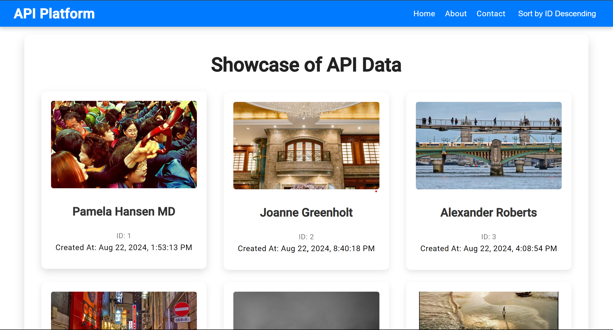

## Data Fetch Application

## Overview
This project is a data fetch application built with Angular. It showcases how to fetch data from an API and display it in a user-friendly manner.

## Features
- Responsive navbar with sorting functionality.
- Display API data with error handling and loading states.

## Screenshots

Here is a screenshot of the application:



## Setup and Installation

### Prerequisites
- Node.js (version 14.x or later)
- npm (Node Package Manager)

### Installation
1. Clone the repository:
    ```bash
    https://github.com/NitinBharti007/DataFetchApp.git
    ```
2. Navigate into the project directory:
    ```bash
    cd DataFetchApp
    ```
3. Install the required dependencies:
    ```bash
    npm install
    ```

### Running the Application
To start the development server and run the application, use:
```bash
ng serve
```
Then, open your browser and navigate to \`http://localhost:4200\`.

### Building the Application
To build the project for production, use:
```bash
ng build --prod
```
This will generate a \`dist\` folder with the compiled files.

### Testing
To run unit tests for the application, use:
```bash
ng test
```

## Configuration
Configuration settings can be adjusted in the \`src/environments/\` directory. For example, you can change the API endpoint in \`environment.ts\` and \`environment.prod.ts\`.

## Troubleshooting
- Ensure Node.js and npm are properly installed.
- Verify that all dependencies are correctly installed by running \`npm install\`.

## Contributing
Feel free to submit pull requests or open issues if you encounter any problems or have suggestions for improvements.

## License
This project is licensed under the MIT License. See the [LICENSE](LICENSE) file for details.

## Contact
For any questions or inquiries, please contact dev.nitin63@gmail.com.

" > README.md
